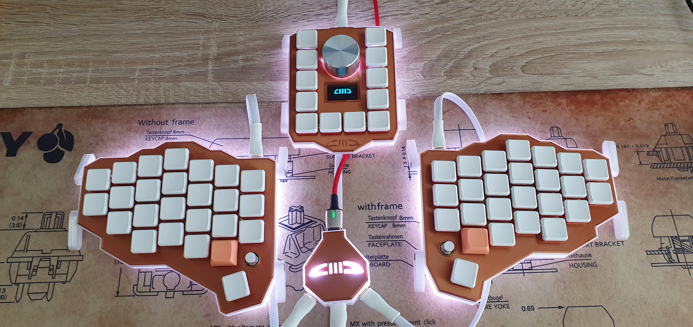

# IIICC
### Three piece split keyboard with macropad running QMK

Features
- Split ergo
- Additional optional macropad with OLED and rotary encoder
- Central Hub design with only one controller to flash
- 5 way switch on each half for additonal functionality 
- Support for tenting (Ergodox feet should fit), rubber/aluminum feet, 3D printed (included)
- RGB underglow
- 3D printed case and plates
- Support for Kailh Choc V1, Choc V2 and X-Switch(laptop scissor) 
- QMK firmware
- All USB-C connectors
- 'Hexa' case designed by [Sean Yin](https://www.coroflot.com/sean_yin)

[Assembly manual](Doc/IIICC_Assembly_Guide.pdf)

[IIICC @ EasyEDA](https://easyeda.com/pigboard)